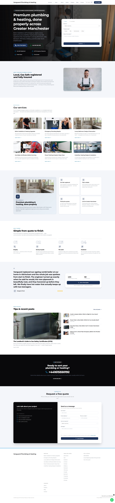

# Groundwork

**An SEO-first Next.js 16 + Sanity starter for local-business & trade websites —
with a 4-week SEO engine built in.**

Groundwork is a production-grade starter for building fast, content-managed
websites for local businesses — plumbers, electricians, salons, builders, clinics
and the like — *and then actually ranking them*. It pairs a polished, CMS-driven
site with a real SEO operations toolkit: pull Google Search Console / GA4 / Google
Business Profile / Ahrefs data, turn it into a weekly action list, and work a
disciplined 4-week review cycle.



> **Live demo:** https://next-js-16-sanity-starter-for-local.vercel.app

---

## Two halves

**1. The website** — a fast, editable local-business site
- **Schema.org knowledge graph, not scattered snippets.** `LocalBusiness`,
  `Service`, `Person`, `BreadcrumbList`, `FAQPage`, `ImageObject` and `WebSite`
  nodes share stable `@id`s and cross-reference each other, so Google reads one
  connected entity graph.
- **A page builder editors can actually use** — hero, services, pricing, process,
  testimonials, trust bar, FAQ, CTA, gallery and contact blocks, composed in Sanity.
- **Type-safe end to end** — GROQ queries generate TypeScript types; CI fails if
  the committed types drift from the schema.
- **Lead capture that won't lose a lead** — contact form with a honeypot, per-IP
  rate limiting, optional Cloudflare Turnstile, and Nodemailer delivery.
- **Design presets** — swap the whole palette with one env var.

**2. The 4-week SEO engine** — [`frontend/seo/`](./frontend/seo) + [`scripts/`](./scripts)
- A one-command **weekly runner** that pulls GSC + GA4 + GBP + Ahrefs + DataForSEO,
  cross-attributes the movement, and writes a single digest + an Excel workbook.
- **Striking-distance analysis** (page-2 rankings worth pushing), content-depth
  briefs, citation/NAP tooling, and GBP post drafting.
- A disciplined **Day 0 → 28 → 56 → 84** review rhythm with pre-written
  decision gates — see [the SEO Playbook](./frontend/seo/SEO-PLAYBOOK.md).

Every external API is **optional** — with no keys the toolkit degrades to a clean
no-op, so the site half works on its own.

---

## Tech stack

| | |
| --- | --- |
| **Framework** | Next.js 16 (App Router, RSC, Turbopack) |
| **CMS** | Sanity Studio (typed schemas + page builder + live preview) |
| **Styling** | Tailwind CSS v4 + shadcn/ui + Framer Motion |
| **Language** | TypeScript, strict, end-to-end typed GROQ |
| **SEO engine** | Node ESM scripts — GSC, GA4, GBP, Ahrefs, DataForSEO + xlsx reporting |
| **CI** | GitHub Actions — typecheck, type-drift guard, tests, lint, build |

A pnpm monorepo: [`frontend/`](./frontend) (the site + SEO toolkit) and
[`studio/`](./studio) (the Sanity Studio).

---

## Quick start (the website)

**Prerequisites:** Node 20+, [pnpm](https://pnpm.io), and a free
[Sanity](https://www.sanity.io) project.

```bash
# 1. Install
pnpm install

# 2. Configure env (frontend + studio each have their own)
cp frontend/.env.example frontend/.env   # Sanity project id, dataset, read token, contact email
cp studio/.env.example studio/.env        # SANITY_STUDIO_PROJECT_ID + dataset

# 3. Seed starter content (uses your `sanity login` session)
pnpm -F studio seed:all       # settings, nav/footer, services, demo pages

# 4. Run frontend + studio together
pnpm dev                      # site → http://localhost:3000  studio → :3333
```

Seed a different demo vertical with `SEED_TRADE=electrician pnpm -F studio seed:all`
(packs live in [`studio/scripts/trade-packs/`](./studio/scripts/trade-packs)).

---

## The 4-week SEO engine

The toolkit lives in [`frontend/seo/`](./frontend/seo) and runs from the repo root.
It reads the client's NAP/services/areas straight from Sanity (no duplicate config)
and writes every output to `frontend/seo/data/` (gitignored). The full methodology
— how to read each data source and what to do about it — is in
**[`frontend/seo/SEO-PLAYBOOK.md`](./frontend/seo/SEO-PLAYBOOK.md)**.

### Prerequisites (all optional — set only what you use)

Add these to `frontend/.env` (see [`.env.example`](./.env.example) for the full list):

- **Google (GSC + GA4 + optional GBP)** — one OAuth client covers all three. Create
  an OAuth client in Google Cloud, then use the
  [OAuth Playground](https://developers.google.com/oauthplayground) to grant **all**
  scopes in a single exchange (`webmasters.readonly`, `analytics.readonly` +
  `analytics.edit`, `business.manage`) and copy the refresh token into
  `GOOGLE_CLIENT_ID` / `GOOGLE_CLIENT_SECRET` / `GOOGLE_REFRESH_TOKEN`. Google issues
  one refresh token per consent — you can't add scopes later, so grant them together.
- **DataForSEO** (`DATAFORSEO_LOGIN` / `DATAFORSEO_PASSWORD`) — cheap keyword volume +
  SERP research at onboarding.
- **Ahrefs** (`AHREF_API_KEY`) — competitor/keyword/backlink gaps, run monthly only.

### The cadence

```
Day 0   Freeze GSC/Ahrefs baselines, deploy, request indexing for the top pages
Weekly  `node frontend/seo/monday-runner.mjs`  → one digest + Excel workbook (~5–10 min, Mondays)
Day 28  First-signal review → Pattern A/B/C decision (the toolkit pre-writes the action list)
Day 56  Second review + keep/cancel tooling decisions
Day 84  Whole-programme decision gate
```

Between gates you **execute, don't re-debate**. The Monday run never half-fails —
each step is an isolated child process, so a GSC timeout still leaves you the GA4
and Ahrefs reports.

### Key commands

```bash
# Onboarding — research + scaffold a client
node scripts/research-brief.mjs        # keyword volume + SERP (DataForSEO)
node scripts/author-content.mjs        # draft page content from the brief
node scripts/verify-tenant.mjs         # gate: depth + no-fabrication checks
pnpm onboard                           # generate the per-client SEO handoff

# Weekly
node frontend/seo/monday-runner.mjs    # the whole stack → frontend/seo/data/

# Monthly (4-weekly)
node frontend/seo/ahrefs-competitor-gap.mjs
node frontend/seo/ahrefs-keyword-gap.mjs
```

Per-client tuning is just two files: `frontend/seo/ahrefs-config.mjs` (target +
competitors + priority keywords) and the generated `AI-HANDOFF.md`.

> **Note on data integrity:** the content tooling is built to *not fabricate* — no
> invented reviews, ratings, accreditations or NAP. Briefs are structure + keyword
> + FAQ targets; the prose and the facts are yours.

---

## Project structure

```
frontend/
  app/                 # routes (home, services, areas, blog, contact, …)
    components/        # sections, page-builder blocks, nav/footer
  sanity/lib/          # client, typed GROQ queries, JSON-LD + SEO helpers
  lib/themes.ts        # design presets (palette → CSS variables)
  seo/                 # the SEO engine (GSC/GA4/GBP/Ahrefs/DataForSEO + runner)
    SEO-PLAYBOOK.md    # the operating methodology
studio/
  src/schemaTypes/     # documents, singletons (settings), objects, page-builder
  scripts/             # seed scripts + trade content packs
scripts/               # onboarding + content pipeline (research → author → verify)
.github/workflows/     # CI + the weekly SEO cron
```

The JSON-LD builders ([`frontend/sanity/lib/jsonld.ts`](./frontend/sanity/lib/jsonld.ts))
and the design-preset system ([`frontend/lib/themes.ts`](./frontend/lib/themes.ts))
are the most reusable pieces — both are framework-agnostic enough to lift out.

---

## Deployment

- **Frontend → Vercel.** Import the repo, set the root to `frontend/`, add the env
  vars. Routes are dynamic, so no Sanity connection is needed at build time.
- **Studio → Sanity hosting.** `pnpm -F studio deploy`.

Set `NEXT_PUBLIC_SITE_URL` to your production domain — it drives the canonical
URLs, Open Graph tags, `sitemap.xml` and `robots.txt`. Nothing hardcodes a domain.

---

## License

[MIT](./LICENSE) © Janusz Wozniak (JW Digital). Use it, fork it, ship client sites
with it.
